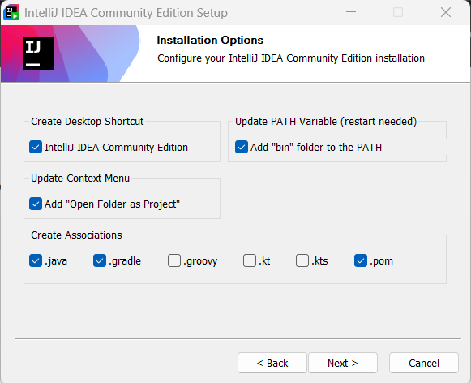
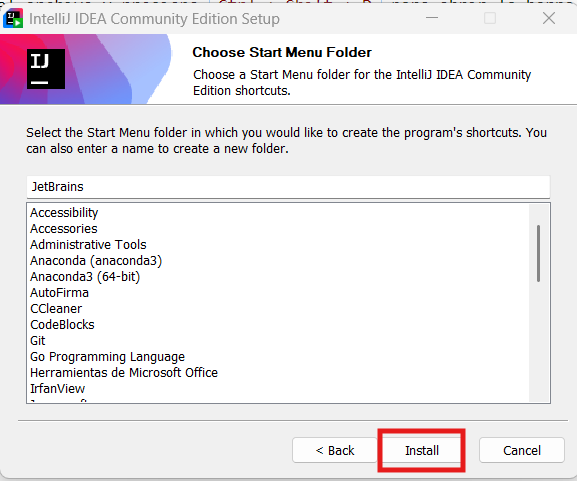

# Capítulo 1: Introducción a Java

## 1.1. ¿Qué es un lenguaje de programación?

Un **lenguaje de programación** es un sistema de notación diseñado para escribir instrucciones que una computadora puede interpretar y ejecutar. Existen diferentes paradigmas de programación, entre los que se destacan:

1. **Lenguajes de bajo nivel**: Como el lenguaje ensamblador, que se comunica directamente con el hardware y tiene una sintaxis dependiente de la arquitectura del procesador.
2. **Lenguajes de medio nivel**: Como el lenguaje C, que permite una gestión más detallada de los recursos del sistema sin ser tan específico del hardware. Actualmente, Rush se posiciona como un posible líder futuro en el segmento.
3. **Lenguajes de alto nivel**: Como Java, Python y C++, que son más comprensibles para los humanos y ofrecen abstracciones que facilitan la programación sin necesidad de conocer detalles específicos del hardware.

Como se puede deducir, a mayor nivel de abstracción (más entendible para los humanos) se paga en rendimiento, aunque poco a poco han ido mejorando en cuestiones de eficiencia. No obstante, a día de hoy (2025, en el momento de redactar estos apuntes), lenguajes como Rush, C++ o C siguen siendo los más empleados para sistemas embebidos y aplicaciones de alta optimización.

4. **Lenguajes interpretados y compilados**:  
   - Los **lenguajes compilados** (como C y C++) requieren una traducción previa a código máquina, generando un archivo ejecutable.  
   - Los **lenguajes interpretados** (como Python o JavaScript) se ejecutan directamente sin una fase de compilación previa.  
     
   Java combina ambas estrategias a través de su Máquina Virtual de Java (JVM), ya que primero compila el código fuente a un formato intermedio (bytecode) y luego lo ejecuta mediante la JVM.

### Ejemplo comparativo entre ensamblador, C y Java

A continuación, se muestra un ejemplo de código que realiza la misma funcionalidad en los tres lenguajes, incrementando un número en una variable.

**Código en ensamblador (8086):**
```assembly
section .data
    num db 5

section .text
global _start

_start:
    mov al, [num]
    inc al
    mov [num], al

    mov eax, 1
    int 0x80
```

**Código en C (con punteros):**
```c
#include <stdio.h>

int main() {
    int num = 5;
    int *ptr = &num;
    (*ptr)++;
    printf("Valor de num: %d\n", num);
    return 0;
}
```

**Código en Java:**
```java
public class Incremento {
    public static void main(String[] args) {
        int num = 5;
        num++;
        System.out.println("Valor de num: " + num);
    }
}
```

Como se observa, en ensamblador se requiere manipular directamente registros y memoria, en C se usan punteros para acceder y modificar el valor, mientras que en Java el código es más abstracto y sencillo gracias a su alto nivel de abstracción.

## 1.2. Orígenes de Java

Java fue creado por **James Gosling** y su equipo en **Sun Microsystems** a principios de la década de 1990. Originalmente, se llamaba **Oak** y estaba destinado a ser utilizado en dispositivos electrónicos de consumo. Sin embargo, la posibilidad de ejecutar código en diferentes plataformas sin modificaciones lo llevó a convertirse en un lenguaje clave para el desarrollo de software.

En 1995, Java fue presentado oficialmente y, desde entonces, ha evolucionado con numerosas versiones y mejoras. Hoy en día es mantenido por **Oracle Corporation** y sigue siendo uno de los lenguajes de programación más utilizados en el mundo.

## 1.3. Instalación de Java en Windows

Para comenzar a programar en Java, es necesario instalar el **Kit de Desarrollo de Java (JDK)**. Este incluye el compilador `javac`, la JVM y herramientas adicionales para el desarrollo de aplicaciones.

### Pasos para instalar el JDK en Windows:

1. **Descargar el JDK**
   - Visita la página oficial de Oracle: [https://www.oracle.com/java/](https://www.oracle.com/java/)
   - Descarga la última versión del JDK compatible con Windows.
   - Actualmente: [https://download.oracle.com/java/23/latest/jdk-23_windows-x64_bin.msi](https://download.oracle.com/java/23/latest/jdk-23_windows-x64_bin.msi)

2. **Instalar el JDK**
   - Ejecuta el instalador descargado y sigue las instrucciones en pantalla.
   - Selecciona el directorio de instalación (se recomienda dejar la ruta por defecto).

3. **Configurar las variables de entorno**
   - Abre el Explorador de archivos, haz clic derecho en "Este equipo" y selecciona "Propiedades".
   - Haz clic en "Configuración avanzada del sistema" y en la pestaña "Opciones avanzadas" selecciona "Variables de entorno".
   - En "Variables del sistema", busca `JAVA_HOME` (si no existe, créala) y establece su valor como la ruta de instalación del JDK (por ejemplo, `C:\Program Files\Java\jdk-17`).
   - Agrega `C:\Program Files\Java\jdk-17\bin` a la variable `Path`.

4. **Verificar la instalación**
   - Abre una ventana de **Símbolo del sistema** (`cmd`) y ejecuta los siguientes comandos:
     ```
     java -version
     javac -version
     ```
   - Deberías ver información sobre la versión instalada de Java y del compilador.

## 1.4. Configuración de Java en Visual Studio Code

Para programar en Java con **Visual Studio Code (VS Code)**, es necesario instalar algunas extensiones adicionales.

### Pasos para configurar Java en VS Code:

1. **Instalar Visual Studio Code**
   - Descarga e instala **VS Code** desde su sitio oficial: [https://code.visualstudio.com/](https://code.visualstudio.com/).

2. **Instalar la Extensión de Java**
   - Abre VS Code y ve al "Marketplace" de extensiones (`Ctrl + Shift + X`).
   - Busca e instala **"Extension Pack for Java"**, que incluye:
     - Language Support for Java(TM) by Red Hat
     - Debugger for Java
     - Test Runner for Java
     - Maven for Java
     - IntelliCode for Java

3. **Configurar la ejecución de Java en VS Code**
   - Abre VS Code y crea una nueva carpeta para tu proyecto.
   - Dentro de la carpeta, crea un archivo `HolaMundo.java` con el siguiente contenido:
     ```java
     public class HolaMundo {
         public static void main(String[] args) {
             System.out.println("Hola, mundo!");
         }
     }
     ```
   - Guarda el archivo y presiona `Ctrl + Shift + P` para abrir la barra de comandos.
   - Escribe `Java: Configure Runtime` y selecciona la versión del JDK instalada.
   - Para ejecutar el código, abre el terminal en VS Code (`Ctrl + ñ`), y usa:
     ```
     javac HolaMundo.java
     java HolaMundo
     ```

## 1.5. Configuración de Java en Intellij

Para programar en Java con **Intellij**, sigue estos pasos:

- Visita el sitio oficial: [https://www.jetbrains.com/idea/](https://www.jetbrains.com/idea/)
- Selecciona **Community Edition**.
- Descarga el instalador (archivo `.exe` en Windows).

  


- Finalmente, se recomienda reiniciar el ordenador, ya que algunas opciones pueden requerirlo para configurarse correctamente.

## 1.6. Compilación y la Máquina Virtual de Java (JVM)

### ¿Qué es compilar?

**Compilar** es el proceso de traducir el código fuente, escrito en un lenguaje de alto nivel, a un formato que la computadora pueda ejecutar (ya sea directamente a código máquina o a un código intermedio). Durante la compilación, el compilador analiza el código en busca de errores de sintaxis y semántica y lo transforma en una representación optimizada para la ejecución.

- **Ejemplo en C:**  
  El compilador traduce el código fuente a un archivo ejecutable con código máquina, específico para la plataforma en la que se compiló.
- **Ejemplo en Java:**  
  El compilador `javac` convierte el código fuente (archivos `.java`) en un código intermedio llamado **bytecode** (archivos `.class`). Este bytecode es independiente de la plataforma.

### Proceso de compilación en Java

El proceso de compilación y ejecución en Java se puede dividir en los siguientes pasos:

1. **Escritura del código fuente:**  
   El programador escribe el código en un archivo con extensión `.java`.  
   _Ejemplo:_
   ```java
   public class MiPrograma {
       public static void main(String[] args) {
           System.out.println("¡Hola, mundo!");
       }
   }
   ```

2. **Compilación del código fuente:**  
   Se utiliza el compilador de Java (`javac`) para traducir el código fuente a bytecode.  
   _Comando:_
   ```
   javac MiPrograma.java
   ```
   Si el compilador encuentra errores de sintaxis o semánticos, se mostrarán mensajes que ayudarán al programador a corregirlos antes de continuar.

3. **Ejecución del bytecode:**  
   Una vez generado el bytecode (archivo `.class`), se utiliza el comando `java` para ejecutarlo.  
   _Comando:_
   ```
   java MiPrograma
   ```
   Durante este paso, la Máquina Virtual de Java (JVM) se encarga de:
   
   - **Cargar** el bytecode en memoria.
   - **Verificar** que el bytecode cumple con las normas de seguridad y no contiene instrucciones dañinas.
   - **Interpretar** el bytecode o compilarlo en tiempo real (utilizando la compilación Just-In-Time, JIT) a código máquina específico de la plataforma.
   - **Ejecutar** el programa.

### ¿Qué es la Máquina Virtual de Java (JVM)?

La **Máquina Virtual de Java (JVM)** es un componente esencial del ecosistema Java que actúa como una capa intermedia entre el bytecode y el hardware. Sus principales funciones son:

- **Portabilidad:**  
  Gracias a la JVM, el mismo bytecode generado en una plataforma puede ejecutarse en cualquier otro sistema operativo que disponga de una JVM compatible, eliminando la necesidad de recompilar el código para cada plataforma.

- **Seguridad:**  
  La JVM verifica el bytecode antes de su ejecución, ayudando a prevenir la ejecución de código malicioso y protegiendo al sistema de errores potencialmente peligrosos.

- **Gestión de memoria:**  
  La JVM se encarga de asignar y liberar memoria de manera automática (mediante el recolector de basura), lo que reduce la posibilidad de errores comunes como fugas de memoria.

- **Optimización en tiempo de ejecución:**  
  Utilizando técnicas como la compilación Just-In-Time (JIT), la JVM optimiza el rendimiento del programa al compilar dinámicamente partes del bytecode en código máquina nativo durante la ejecución.

### Ejemplo práctico del proceso en Java

Considera el siguiente ejemplo en Java:

```java
public class EjemploCompilacion {
    public static void main(String[] args) {
        int numero = 5;
        numero++;
        System.out.println("El valor incrementado es: " + numero);
    }
}
```

El proceso para ejecutar este programa es:

1. **Guardar** el código en un archivo llamado `EjemploCompilacion.java`.

2. **Compilar** el código:
   ```
   javac EjemploCompilacion.java
   ```
   Esto generará el archivo `EjemploCompilacion.class` que contiene el bytecode.

3. **Ejecutar** el bytecode:
   ```
   java EjemploCompilacion
   ```
   La JVM carga y verifica el bytecode, lo compila (si es necesario) y ejecuta el programa, mostrando en pantalla:
   ```
   El valor incrementado es: 6
   ```
