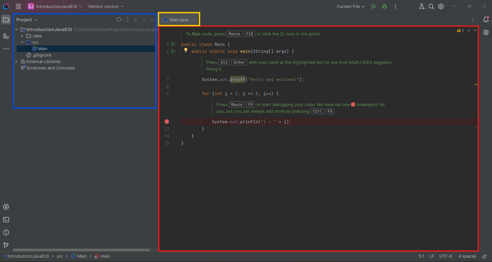
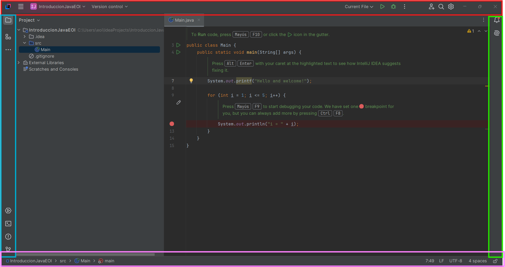
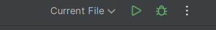

## Interfaz Básica de Intellij

Este tutorial describe los pasos para configurar el IDE, la primera vez que lo iniciamos justo después de instalarlo.

### Pantalla Principal.
En esta primera pantalla Podemos observar las dos grandes partes del IDE.
- En rojo está el área principal del código. Aquí es donde escribiremos los programas.
- En amarillo arriba está el nombre del fichero que tiene el contenido que vemos en rojo. Lo normal es trabajar en muchos ficheros distintos a la vez, por lo que cada fichero aparecerá en una pestña nueva, pudiendo incluso mover el contenido a otro monitor o dividir pantalla... Se irá viendo a lo largo del curso.
- En azul tenemos el **árbol del proyecto**. Ahora que estamos aprendiendo tendremos distintos ficheros fuente distintos, pero a medida que avancemos en el curso, se irán creando proyectos más complejos que tendrán dependencias. Esta parte es fundamental para poder acceder a todo el contenido del proyecto.

### Barras de Atajos.
En la siguiente imagen encontraremos las barras de atajos. Estan divididas en cuatro partes. 

- En rojo tenemos probablemente la parte más importante ya que tiene los botones para:
  - Compilar el proyecto. 
  - Depurar el proyecto
  - Abrir la barra de herramientas completa donde se encuentran todas las posibles opciones del IDE.
- En azul tenemos una barra auxiliar de atajos que contiene:
  - La consola, donde nosotros podremos ejecutar y compilar manualmente, ver los resultados de consola, ... En esta primera parte del curso esta consola es bastante importante. 
  - El botón de versión de control, que es especialmente importante cuando estamos trabajando en real ya que es el sistema que almacena los cambios en el proyecto. Pensad que normalmente no trabajamos nosotros solos, sino que tenemos que trabajar en equipo, por tanto, actualizar los cambios entre los miembros del equipo se vuelve una tarea crucial, pero, para poder usar eso deberíamos de usar GIT, que es el sistema en el que se basa github y queda fuera del contexto del curso (es tan extenso que requeriría un curso aparte.)
  - En verde tenemos otra barra de atajos, que es aquella donde aparecerán las notificaciones y en las últimas versiones tenemos un botón para activar la IA. Pero esta opción es bajo subscripción.
  - Por último en Lila, abajo tenemos una barra donde aparece información del fichero que tenemos abierto y por otra parte nos indica la línea y columna en la que estamos trabajando (especialmente importante cuando tenemos errores en nuestro código). LF que indica el salto de línea. Esto es importante dependiendo de si estamos en windows o linux y luego aparece UTF-8 que es el sistema de codificación. El sistema de codificación indica el juego de caracteres que usamos. No es lo mismo estar escribiendo en nuestra lengua o inglés, por ejemplo en el que las letras son las que nosotros entendemos como usuales, a escribir con caracteres chinos, árabes...
  - 

Para nosotros (en este momento del curso) vamos a prestar especial atención a :

En esta imagen podemos ver:
- Un dibujo de un triángulo que es el botón que deberemos de usar siempre cuando queramos ejecutar un programa.
- El dibujo del "bicho", precisamente representa eso, un "bug" (bicho en inglés), por lo que es el botón que emplearemos para lanzar el programa en modo de depuración. En este modo podremos ir parando el código línea a línea y examinar los contenidos de variables... Con el fin de obtener información para poder reparar posibles fallos que aparezcan en el código.
