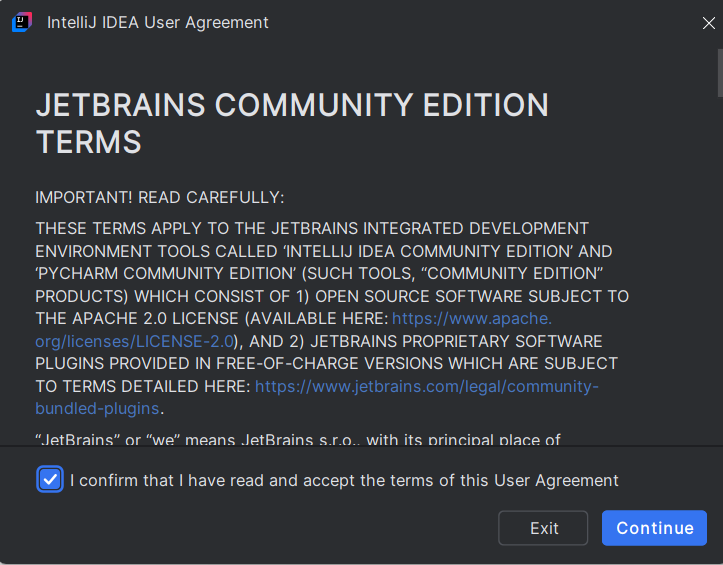
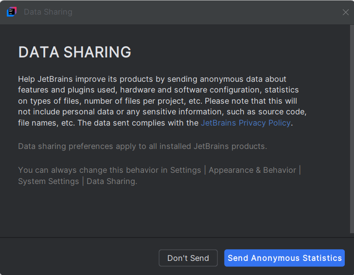
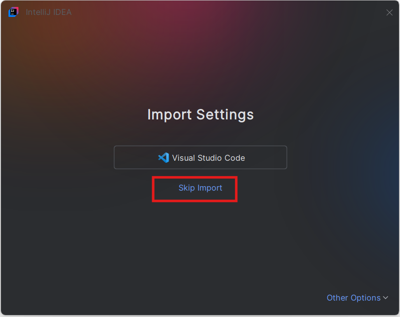
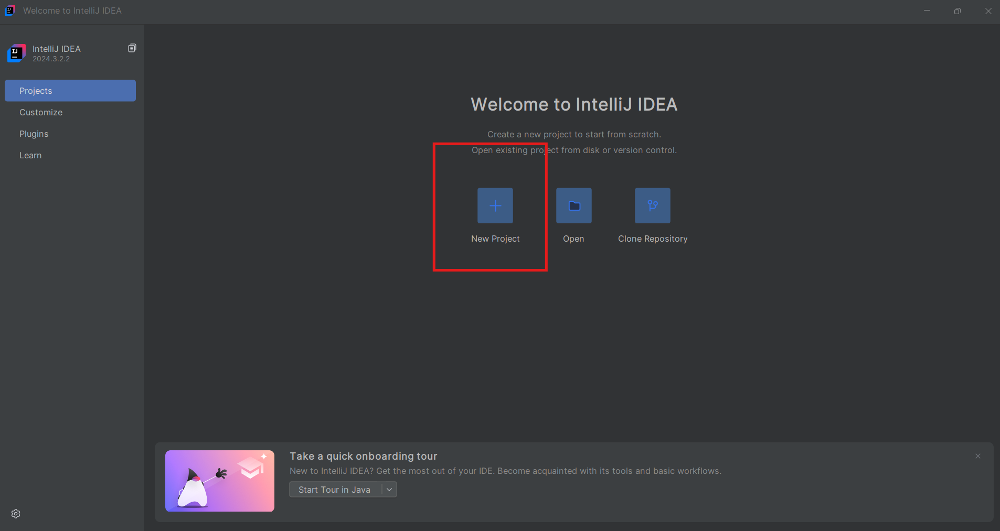
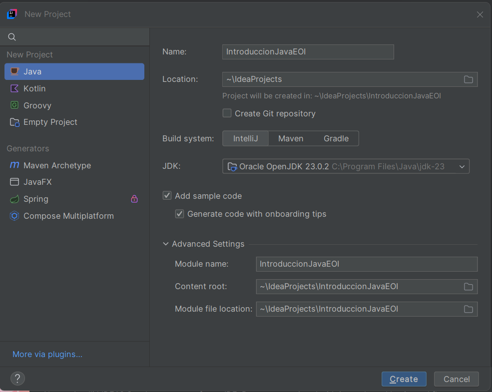
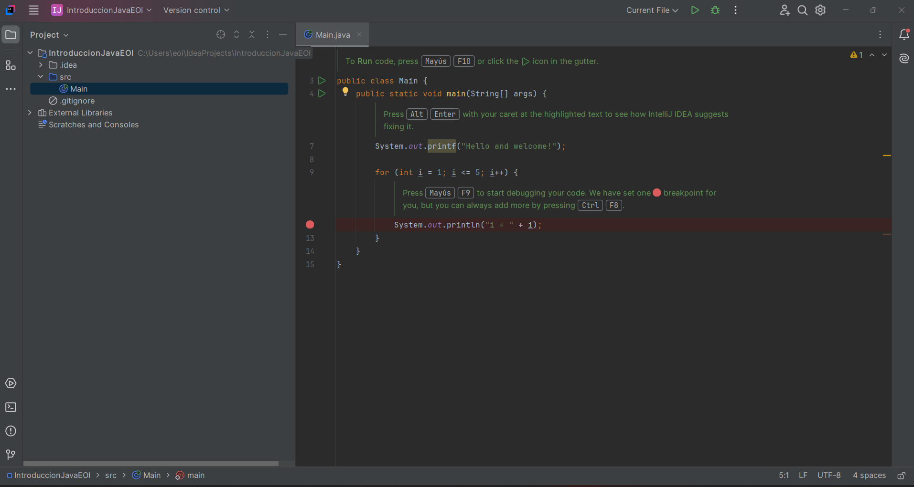

  

## Primera vez con intellij

Este tutorial describe los pasos para configurar el IDE, la primera vez que lo iniciamos justo después de instalarlo.

### Aceptamos las condiciones.
Leemmos y aceptamos las condiciones. Sin aceptar las condiciones no podemos entrar al IDE.

### Compartir datos
En esta pantalla tenemos dos opcion:
- Compartir datos **de manera anónima** o bien no compartir datos. Ésto se hace para que los desarrolladores puedan obtener información sobre uso, configuración errores, ... Para poder mejorar las siguientes versiones. 
  
- No compartir datos. En este caso el programa no envía la información anterior.
- 

### Import Settings.
Aquí debemos de seleccionar, por el momento **Skip Import**. 

En el caso de que seamos usuarios avanzados y tengamos una configuración muy personalizada que quiera conservar podríamos seleccionar la importación de datos de Visual Studio Code, pero, en el caso de que no sea así, la importación podría cambiar configuración por defecto y luego tener problemas.

Como esta parte es la de introducción, lo mejor es que a que no estemos más familiarizados con IDE no toquemos nada.

### Creación de proyecto.
La siguiente pantalla que nos aparece es la que nos permite crear un proyecto por primera vez. 

- New Project: Nos permite crear un proyecto desde cero. 
- Open: Cuando tenemos ya un proyecto creado en alguna unidad o directorio y queremos cargarlo.
- Clone Repository: Cuando nos queramos bajar un proyecto desde GIT.

Dado que estamos en la sección de introducción y estamos partiendo de cero, deberemos de seleccionar la opción de **New Project**

### Configuración de proyecto por defecto.

Ahora que estamos comenzando no deberemos de tocar nada salvo el nombre de proyecto. Posteriormente, a lo largo del curso, en proyectos más avanzados tendremos que seleccionar los gestores de paquetes, Maven o Gradle, pero por el momento nosotros no vamos a usarlos con lo que tendremos que seleccionar **Intellij** como build System.

Si hemos instalado java según el documento de **InstalacionJava**, tendremos una pantalla como la que se muestra a continuación.

Debemos de tener en cuenta que Intellij, nos permite la instalación automática de la librería jdk en diversas versiones. Ésto es muy importante porque cuando trabajamos en la vida real, es complicado no tener que usar varias versiones de jdk. Pensad, que cuando hacemos un proyecto es muy probable tener diferentes versiones del mismo instaladas en clientes.

El procedimiento explicado en el documento de instalación de Java, es el procedimiento Standard para tener el JDK correctamente configurado en cualquier IDE. Aunque Intellij es el IDE más famoso y probablemente, el más potente de Java, es muy frecuente ir a empresas donde tienen Eclipse, o Visual Studio code y pensad que por homogeneidad, normalmente, no podemos elegir el IDE, sino que hay muchas empresas que nos imponen uno.

### Proyecto Incial.

¡Ya está! Acabamos de crear nuestro primer proyecto. A partir de ahora empieza el viaje.
El documento **InterfazBasica**, explica los conceptos básicos de la interfaz de intellij para comenzar a trabajar.

